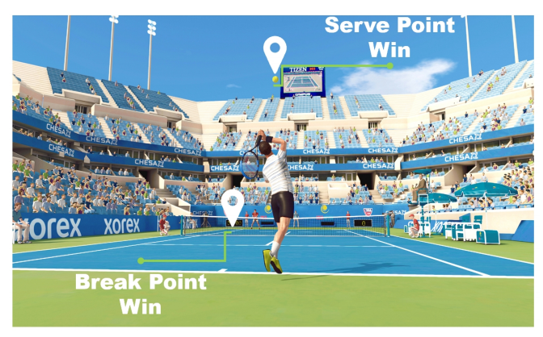
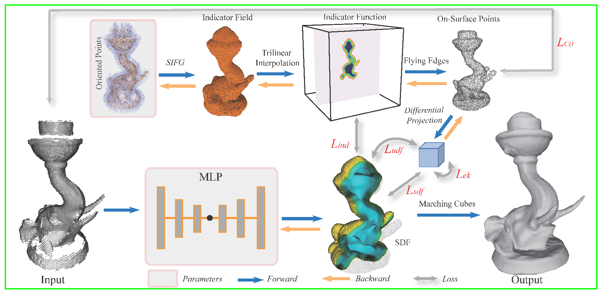
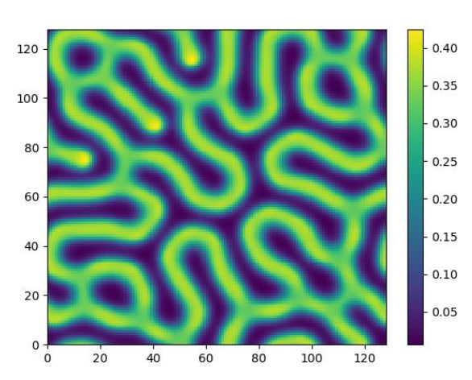
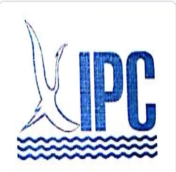

I'm a senior undergraduate student from School of Artificial Intelligence, Beijing Normal University. My research interest includes computer vision, computer graphics and machine learning. I was very fortunate to be advised by Prof. Shi-Sheng Huang.

I'm currently taking internship in VAST(Beijing) working with Dr. Zi-Xin Zou. I work on topics about 3D generation and reconstruction including neural rendering and generative models.

You can find my CV here: [Li-Heng Chen's Curriculum Vitae](../assets/CHENLiheng_CV_aug20.pdf)

[School Email](mailto:202111081084@mail.bnu.edu.cn) / [Personal Email](mailto:liheng.chen0308@gmail.com) /[Github](https://github.com/CountNemoChan)

  

# ACADEMIC EXPERIENCE

  

    
  

  

    
<strong>The Power of Momentum: How to Win the Match with Data</strong>

    
<strong>Li-Heng Chen</strong>, Rui Chen, Yujia Liu

    
<em>MCM2024 (F Prize)</em>

    

      <a href="../assets/2418588.pdf" target="_blank">[Paper]</a> <a href="../assets/certificate_of_mcm.pdf" target="_blank">[Certificate]</a>
    

  

  

    
  

  

    
<strong>NeuralIndicator: Implicit Surface Reconstruction from Neural Indicator Priors</strong>

    
Shi-Sheng Huang, Guo Chen, <strong>Li-Heng Chen</strong>, Hua Huang

    
<em>ICML 2024</em>

    

      <a href="../assets/huang24b.pdf" target="_blank">[Paper]</a>
    

  

  

    
  

  

    
<strong>Construction of a speckle pattern model with paddy field characteristics</strong>

    
Rui Chen, <strong>Li-Heng Chen</strong>, Wentao Qing

    
<em>Beijing Undergraduate Research and Innovation Project.”</em>

    

      <a href="../assets/paddy_field.pdf" target="_blank">[Paper]</a>
    

  

  

# PROFESSIONAL EXPERIENCE

  
  
  

